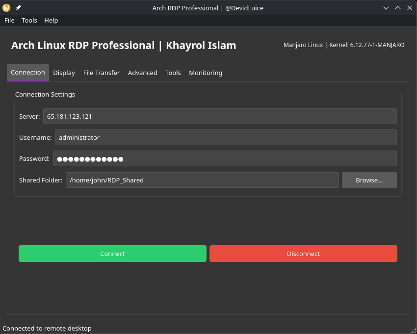

<div align="center">

```
 █████╗ ██████╗  ██████╗██╗  ██╗    ██████╗ ██████╗ ██████╗ 
██╔══██╗██╔══██╗██╔════╝██║  ██║    ██╔══██╗██╔══██╗██╔══██╗
███████║██████╔╝██║     ███████║    ██████╔╝██║  ██║██████╔╝
██╔══██║██╔══██╗██║     ██╔══██║    ██╔══██╗██║  ██║██╔═══╝ 
██║  ██║██║  ██║╚██████╗██║  ██║    ██║  ██║██████╔╝██║     
╚═╝  ╚═╝╚═╝  ╚═╝ ╚═════╝╚═╝  ╚═╝   ╚═╝  ╚═╝╚═════╝ ╚═╝     
```

# 🖥️ Arch Linux RDP Professional Tool

**A powerful, feature-rich Remote Desktop Protocol (RDP) client built with PyQt6 for Arch Linux**

[](https://python.org)
[](https://pypi.org/project/PyQt6/)
[](https://archlinux.org)
[](LICENSE)
[](https://github.com/gitkhayrol)

<br/>


</div>

---

## 📌 Table of Contents

- [Overview](#-overview)
- [Features](#-features)
- [Screenshots](#-screenshots)
- [Prerequisites](#-prerequisites)
- [Installation](#-installation)
- [Usage](#-usage)
- [Configuration](#-configuration)
- [Tab Guide](#-tab-guide)
- [File Structure](#-file-structure)
- [Troubleshooting](#-troubleshooting)
- [Contributing](#-contributing)
- [Author](#-author)
- [License](#-license)

---

## 🔍 Overview

**Arch RDP Professional** is a fully-featured graphical Remote Desktop Protocol (RDP) client tailored specifically for **Arch Linux** users. Built on top of `xfreerdp` and wrapped with a sleek **PyQt6** interface, it provides a professional-grade desktop tool for connecting to, managing, and monitoring remote Windows or RDP-enabled machines — all without touching the terminal.

Whether you're a system administrator, developer, or power user, this tool gives you granular control over every aspect of your RDP session: display quality, security settings, file transfers, keyboard layout, performance monitoring, and much more — all in one dark-themed, intuitive GUI.

---

## ✨ Features

### 🔗 Connection Management
- Quick-connect with saved server IP, username, and password
- Persistent configuration stored in `~/.config/arch-rdp-tool/settings.json`
- One-click connect / disconnect with clear visual feedback
- Auto-reconnect support via `xfreerdp` flags

### 🖥️ Display & Graphics Control
- Fullscreen, preset resolutions (1024×768 up to 2560×1440), or fully **custom resolution**
- **Multi-monitor spanning** support
- Graphics mode selector: **Auto**, **H.264 (AVC444)**, **RFX**, **RemoteFX**
- Quality presets: Auto, Low, Medium, High, Ultra (mapped to `xfreerdp` network modes)

### 📁 File Transfer
- Upload files to the remote session via shared folder
- Download files from the remote session
- Built-in transfer log with success/error feedback
- Configurable shared folder path with folder browser dialog

### 🔒 Security & Authentication
- **Network Level Authentication (NLA)** toggle
- Server certificate validation control
- Password input with secure echo-mode masking

### 🔄 Redirection Options
- ✅ Clipboard redirection
- 🔊 Audio redirection
- 🖨️ Printer redirection
- 💳 Smart card redirection
- 💾 Drive/home directory redirection

### 🛠️ Tools
- Keyboard layout switcher (us, gb, fr, de, es, it, jp) via `setxkbmap`
- One-click screenshot capture via `scrot`
- Built-in **Performance Monitor** (backed by `top`)

### 📊 Monitoring
- Real-time RDP session output log (stdout + stderr)
- Resource usage monitor panel
- Status bar showing live connection state

### 🎨 UI/UX
- Modern **dark theme** using a custom QPalette
- Tabbed interface with logical grouping
- Noto Sans font for clean, readable text on Arch Linux
- Persistent settings auto-saved on every change

---

## 📸 Screenshots

> _Screenshots will be added after the first stable release._

| Connection Tab | Display Settings | File Transfer | Monitoring |
|:-:|:-:|:-:|:-:|
| _(coming soon)_ | _(coming soon)_ | _(coming soon)_ | _(coming soon)_ |

---

## ✅ Prerequisites

Before running the tool, make sure you have the following installed on your Arch Linux system:

### System Dependencies

```bash
sudo pacman -S freerdp xorg-setxkbmap scrot python-pyqt6
```

| Package | Purpose |
|---|---|
| `freerdp` | RDP backend (`xfreerdp` command) |
| `xorg-setxkbmap` | Keyboard layout switching |
| `scrot` | Screenshot capturing |
| `python-pyqt6` | GUI framework |

### Python Dependencies

```bash
pip install PyQt6
```

> ⚠️ **Note:** `PyQt6` should be installed from the Arch repositories (`python-pyqt6`) for best compatibility. Avoid mixing pacman and pip installations.

---

## 🚀 Installation

### Method 1 — Clone & Run

```bash
# Clone the repository
git clone https://github.com/gitkhayrol/arch-rdp-tool.git
cd arch-rdp-tool

# Install system dependencies
sudo pacman -S freerdp xorg-setxkbmap scrot python-pyqt6

# Run the application
python rdp.py
```

### Method 2 — Make it Executable

```bash
chmod +x rdp.py
./rdp.py
```

### Method 3 — Desktop Shortcut (Optional)

Create a `.desktop` file for your application launcher:

```ini
# ~/.local/share/applications/arch-rdp.desktop
[Desktop Entry]
Name=Arch RDP Professional
Comment=RDP Client for Arch Linux
Exec=python /path/to/rdp.py
Icon=network-server
Terminal=false
Type=Application
Categories=Network;RemoteAccess;
```

Then refresh your application menu:

```bash
update-desktop-database ~/.local/share/applications/
```

---

## 🖱️ Usage

### Basic Connection

1. Launch the application: `python rdp.py`
2. Go to the **Connection** tab
3. Enter your **Server IP**, **Username**, and **Password**
4. (Optional) Set a **Shared Folder** for file transfers
5. Click **Connect** — the RDP session will launch

### Disconnecting

- Click the red **Disconnect** button on the Connection tab
- The session is cleanly terminated via `QProcess.terminate()`

---

## ⚙️ Configuration

All settings are automatically saved to:

```
~/.config/arch-rdp-tool/settings.json
```

### Default Configuration

```json
{
    "server_ip": "20.27.222.193",
    "username": "madtiger",
    "password": "",
    "shared_folder": "~/RDP_Shared",
    "resolution": "Fullscreen",
    "gfx_mode": "Auto",
    "quality": "High",
    "clipboard": true,
    "audio": false,
    "printers": false,
    "smartcard": false,
    "drive": false,
    "nla": true,
    "validate_cert": false,
    "panel_always_visible": true,
    "window_management": true,
    "keyboard_layout": "us",
    "multi_monitor": false
}
```

> 💡 You can manually edit this file to pre-configure the tool for your environment.

---

## 📑 Tab Guide

### 🔗 Connection Tab
The main hub. Set your server address, credentials, shared folder, and launch the session.

### 🖥️ Display Tab
Control visual quality:
- Choose from preset or custom resolutions
- Toggle multi-monitor mode
- Pick graphics encoding (Auto, H.264, RFX, RemoteFX)
- Set quality preset (maps to xfreerdp network profiles)

### 📁 File Transfer Tab
Upload or download files through the RDP shared folder. All actions are logged in the built-in transfer log.

### 🔒 Advanced Tab
Fine-tune:
- Redirection toggles (clipboard, audio, printers, smart cards, drives)
- Security settings (NLA, certificate validation)
- Window management preferences

### 🛠️ Tools Tab
- Apply keyboard layouts on-the-fly
- Capture screenshots of your RDP session
- Launch a process-based performance monitor

### 📊 Monitoring Tab
Live view of:
- RDP session stdout/stderr output
- System resource usage from `top`

---

## 📂 File Structure

```
arch-rdp-tool/
│
├── rdp.py                   # Main application entry point
├── README.md                # This file
├── LICENSE                  # MIT License
│
└── ~/.config/arch-rdp-tool/ # Auto-created config directory
    ├── settings.json        # User settings (auto-saved)
    └── connections.json     # Saved connections (reserved for future use)
```

---

## 🔧 Troubleshooting

### `xfreerdp: command not found`
```bash
sudo pacman -S freerdp
```

### `setxkbmap: command not found`
```bash
sudo pacman -S xorg-setxkbmap
```

### `scrot: command not found`
```bash
sudo pacman -S scrot
```

### PyQt6 Import Error
```bash
sudo pacman -S python-pyqt6
# or
pip install PyQt6
```

### Connection Refused / NLA Error
- Ensure your Windows server has RDP enabled (System Properties → Remote Desktop)
- Try disabling **NLA** in the Advanced tab if your server doesn't support it
- Try enabling **"Don't validate certificate"** for self-signed cert environments

### Black Screen After Connect
- Try switching **Graphics Mode** from Auto to **H.264** or **RFX**
- Lower the **Quality** setting
- Try a lower resolution

---

## 🤝 Contributing

Contributions are welcome! Here's how to get started:

```bash
# Fork the repo, then:
git clone https://github.com/gitkhayrol/arch-rdp-tool.git
cd arch-rdp-tool

# Create a feature branch
git checkout -b feature/your-feature-name

# Make your changes, then commit
git add .
git commit -m "feat: describe your feature"

# Push and open a Pull Request
git push origin feature/your-feature-name
```

### Guidelines
- Follow PEP8 Python style conventions
- Keep UI changes consistent with the existing dark theme
- Add comments to complex `xfreerdp` command constructions
- Test on Arch Linux before submitting

---

## 👤 Author

<div align="center">

### Khayrol Islam

[](https://github.com/gitkhayrol/)
[](https://github.com/gitkhayrol/)

*Building tools for the Linux community, one script at a time.*

</div>

---

## 📄 License

```
MIT License

Copyright (c) 2024 Khayrol Islam

Permission is hereby granted, free of charge, to any person obtaining a copy
of this software and associated documentation files (the "Software"), to deal
in the Software without restriction, including without limitation the rights
to use, copy, modify, merge, publish, distribute, sublicense, and/or sell
copies of the Software, and to permit persons to whom the Software is
furnished to do so, subject to the following conditions:

The above copyright notice and this permission notice shall be included in all
copies or substantial portions of the Software.

THE SOFTWARE IS PROVIDED "AS IS", WITHOUT WARRANTY OF ANY KIND, EXPRESS OR
IMPLIED, INCLUDING BUT NOT LIMITED TO THE WARRANTIES OF MERCHANTABILITY,
FITNESS FOR A PARTICULAR PURPOSE AND NONINFRINGEMENT.
```

---

<div align="center">

**⭐ If this tool helped you, please give it a star on GitHub!**

Made with ❤️ for the Arch Linux community by [Khayrol Islam](https://github.com/gitkhayrol/)

```
"BTW, I use Arch."
```

</div>
